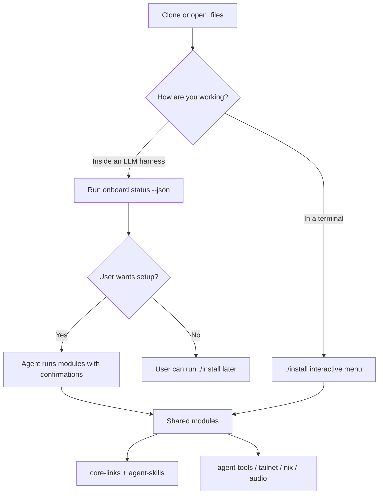

# Setup guide

This repository can be installed two ways. Both call the same modules under
[`scripts/onboard`](../scripts/onboard).



## Method 1 — LLM harness (interactive through chat)

Works with Cursor, Claude Code, Codex, OpenCode, Gemini CLI, Oh My Pi, and similar
tools that read `AGENTS.md` / `CLAUDE.md`.

1. Open this repository in the harness.
2. The agent should run:

```sh
./scripts/onboard status --json
```

3. If onboarding is incomplete, it asks whether you want setup.
4. On yes, it walks modules one by one (or you can say “run `./install` instead”).

Harness autodetection:

```sh
./scripts/onboard detect-harness
```

## Method 2 — Interactive installer (TTY)

From the repo root:

```sh
./install
```

Same thing:

```sh
./scripts/onboard install --interactive
```

Menu options:

1. **Recommended setup** — `core-links` + `agent-skills` (plus optional agent tools prompt)
2. **Full guided setup** — every module with per-module confirmation
3. **Pick modules** — run a custom subset
4. **Status / doctor**
5. **Quit**

Non-interactive examples:

```sh
./scripts/onboard install --module core-links --module agent-skills --yes
./scripts/onboard run agent-tools --yes
```

## Modules

| Module | What it does |
|--------|----------------|
| `core-links` | Symlinks shell, tmux, git, Hyprland, nvim, noctalia, PipeWire fragments, Sunshine config (no credentials), and common CLI helpers into `~` / `~/.local/bin` |
| `agent-skills` | Links `workspace-copilot` into Claude, Codex, OpenCode, Gemini, Cursor, OMP, and Agents skill directories |
| `agent-tools` | Runs [`scripts/setup-agent-tools.sh`](../scripts/setup-agent-tools.sh) (Agent Reach, yt-dlp, mcporter) |
| `tailnet-ssh` | Runs [`scripts/setup-tailnet-ssh.sh`](../scripts/setup-tailnet-ssh.sh) (Linux Tailscale + SSH) |
| `nix-home` | Runs [`config/nix/bootstrap-cachyos.sh`](../config/nix/bootstrap-cachyos.sh) on CachyOS/Arch |
| `audio-evolution` | Runs [`scripts/install-audio-evolution.sh`](../scripts/install-audio-evolution.sh) |

State is stored outside git at:

```text
~/.local/state/dotfiles/onboard.json
```

## Fresh machine checklist

1. Clone the repo (HTTPS is fine for public use):

```sh
git clone https://github.com/kvnloo/.files.git ~/workspace/.files
cd ~/workspace/.files
```

2. Choose a path:

```sh
./install                          # terminal menu
# or open the repo in Cursor/Claude/Codex and accept harness onboarding
```

3. Optional deeper CachyOS migration (packages, full desktop bring-up) still lives
   under [`migration/`](../migration/) and is separate from day-to-day onboarding.

4. Optional Home Manager details: [`config/nix/README.md`](../config/nix/README.md)

## Doctor

```sh
./scripts/onboard doctor
./scripts/onboard status
./scripts/onboard status --json
```

## Legacy entry points

- [`script.sh`](../script.sh) now forwards to `./install` (old macOS/Ubuntu menu is retired).
- [`migration/08-master-migration.sh`](../migration/08-master-migration.sh) remains the one-shot CachyOS migration orchestrator for rebuilds, not the default daily onboarding path.

## Safety

- Do not commit Sunshine `credentials/`, `sunshine_state.json`, or logs.
- Agent Reach secrets stay in `~/.agent-reach` (untracked).
- `wallhaven` / MCP / provider API keys are never stored in this repo’s tracked configs.
