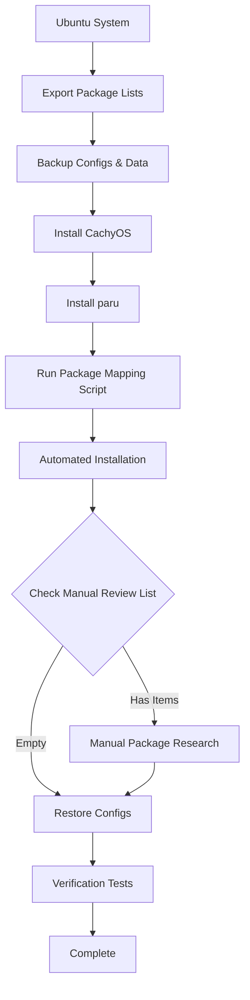

# Package Migration Strategy: Ubuntu → CachyOS (Arch-based)

**Research Date**: 2025-11-25
**Target**: Minimize manual work through automation
**Scope**: System packages, language-specific packages, universal package formats

---

## Executive Summary

Migration from Ubuntu (APT) to CachyOS (Pacman/AUR) requires a hybrid approach combining automated package mapping, language-specific package managers (which are cross-platform), and universal package formats. While no perfect one-to-one automated mapping exists, strategic use of available tools can reduce manual intervention to ~20-30% of packages.

### Key Findings
- **Automated Tools**: Debtap for .deb conversion, TurboArch for system migration
- **Package Name Database**: Arch Wiki's Pacman/Rosetta for command mappings; Debtap maintains internal package name translation
- **Language Package Managers**: npm, pip, cargo, gem are fully cross-platform (zero migration needed)
- **AUR Coverage**: ~85,000+ packages in AUR cover most PPA equivalents
- **CachyOS Optimizations**: x86-64-v3/v4, LTO, PGO, BOLT for performance gains

---

## 1. Package Mapping Methodology

### 1.1 Automated Package Name Translation

#### **Debtap - Primary Translation Tool**
- **Purpose**: Convert .deb packages to Arch packages with accurate name translation
- **Features**:
  - Focuses on accuracy using pkgfile and pacman for package name mapping
  - Maintains internal database for Debian → Arch package name translation
  - Handles dependency translation automatically
  - Available in AUR: `paru -S debtap`

**Usage Pattern**:
```bash
# Install and update
paru -S debtap
sudo debtap -u

# Convert individual .deb packages
debtap package.deb

# Batch conversion
for deb in *.deb; do debtap "$deb"; done
```

**Limitations**:
- Does not create a standalone package list converter
- Works on .deb files, not just package names
- Requires downloading .deb files first for analysis

**Sources**:
- [Debtap GitHub Repository](https://github.com/helixarch/debtap)
- [Arch Linux Forums - Debtap Discussion](https://bbs.archlinux.org/viewtopic.php?id=187558)

#### **Pacman/Rosetta - Command Reference**
- **Purpose**: Command equivalency reference between package managers
- **Coverage**: Primarily command syntax, not package names
- **Location**: [Arch Wiki - Pacman/Rosetta](https://wiki.archlinux.org/title/Pacman/Rosetta)

**Key Command Mappings**:
| Ubuntu (APT) | CachyOS (Pacman) | Description |
|--------------|------------------|-------------|
| `apt install pkg` | `pacman -S pkg` | Install package |
| `apt search pkg` | `pacman -Ss pkg` | Search repositories |
| `apt remove pkg` | `pacman -R pkg` | Remove package |
| `apt update` | `pacman -Sy` | Sync package database |
| `apt upgrade` | `pacman -Syu` | System upgrade |
| `apt list --installed` | `pacman -Q` | List installed |
| `apt-file search file` | `pacman -F file` | Search file in packages |

**Sources**:
- [Arch Wiki - Pacman/Rosetta](https://wiki.archlinux.org/title/Pacman/Rosetta)
- [GitHub - Package Manager Rosetta Stone](https://github.com/blalor/package-manager-rosetta-stone)

### 1.2 Package Name Pattern Recognition

**Common Patterns**:

| Ubuntu Package | Arch Equivalent | Pattern Rule |
|----------------|-----------------|--------------|
| `libfoo-dev` | `libfoo` | Arch doesn't split -dev packages |
| `python3-foo` | `python-foo` | Python 3 is default in Arch |
| `libfoo1.0` | `libfoo` | Arch doesn't version library names |
| `foo-common` | `foo` | Common split often merged |
| `foo-bin` | `foo` | Binary split often merged |

**Automated Pattern Conversion Script** (will be developed):
```bash
#!/bin/bash
# ubuntu_to_arch_name.sh - Pattern-based package name converter

convert_name() {
    local pkg="$1"

    # Remove -dev suffix
    pkg="${pkg%-dev}"

    # Convert python3- to python-
    pkg="${pkg/python3-/python-}"

    # Remove version numbers from library names
    pkg=$(echo "$pkg" | sed 's/[0-9]\+\.[0-9]\+$//')

    # Remove -common suffix
    pkg="${pkg%-common}"

    # Remove -bin suffix
    pkg="${pkg%-bin}"

    echo "$pkg"
}
```

**Sources**:
- [Arch Linux Forums - Package Name Differences](https://bbs.archlinux.org/viewtopic.php?id=222334)
- [Unix StackExchange - Debian vs Arch Package Management](https://unix.stackexchange.com/questions/10103/differences-in-package-management-between-debian-and-arch)

### 1.3 pkgfile - File-Based Package Discovery

**Purpose**: Find which Arch package provides a specific file
**Installation**: `pacman -S pkgfile`
**Update Database**: `sudo pkgfile --update`

**Usage Scenarios**:
```bash
# Find package containing a specific file
pkgfile /usr/bin/vim

# List all files in a package
pkgfile -l vim

# Search with regex
pkgfile -r '\.so$'

# Alternative: built-in pacman -F (since pacman 5.0)
pacman -F /usr/bin/vim
```

**Automation Strategy**: Use pkgfile to validate package availability before installation

**Sources**:
- [Arch Wiki - pkgfile](https://wiki.archlinux.org/title/Pkgfile)
- [pkgfile Manual Page](https://man.archlinux.org/man/extra/pkgfile/pkgfile.1.en)
- [Unix StackExchange - Finding Packages by File](https://unix.stackexchange.com/questions/14858/in-arch-linux-how-can-i-find-out-which-package-to-install-that-will-contain-file)

---

## 2. Package Manager Coverage Strategy

### 2.1 System Packages (APT → Pacman/AUR)

#### **Official Repositories**
- **Coverage**: ~13,000 packages in official Arch repos
- **Strategy**: Primary source for core system packages
- **Tool**: `pacman -S package`

#### **Arch User Repository (AUR)**
- **Coverage**: ~85,000+ packages (largest community repository)
- **Comparison to PPAs**: Single centralized source vs. multiple PPAs
- **Key Advantage**: "Instead of tracking a gazillion PPA's you have one source"
- **Access Method**: AUR helpers (yay, paru)

**AUR Helper Selection (2025 Recommendations)**:

| Tool | Language | Active Dev | Performance | Best For |
|------|----------|------------|-------------|----------|
| **paru** | Rust | ✅ High | ⚡ Fastest | Modern systems, power users |
| **yay** | Go | ✅ Moderate | ✅ Good | Stable, mature alternative |
| pikaur | Python | ✅ Yes | ✅ Good | Review-focused workflows |
| aurutils | Shell | ✅ Yes | ✅ Good | Local repo management |

**Recommendation**: **paru** for 2025 migration
- Written in Rust for performance
- Parallel downloading and installation
- Git package tracking via `--gendb`
- More actively maintained than yay
- Modern feature set with security focus

**Installation**:
```bash
# Manual first-time installation
git clone https://aur.archlinux.org/paru.git
cd paru
makepkg -si

# After paru is installed, use it for AUR packages
paru -S package-name
```

**Sources**:
- [IT'S FOSS - Best AUR Helpers 2025](https://itsfoss.com/best-aur-helpers/)
- [GitHub - paru](https://github.com/Morganamilo/paru)
- [GitHub - yay](https://github.com/Jguer/yay)
- [Arch Wiki - AUR Helpers](https://wiki.archlinux.org/title/AUR_helpers)
- [Ask Ubuntu - AUR vs PPA Comparison](https://askubuntu.com/questions/599135/does-ubuntu-have-an-equivalent-to-the-aur-arch-user-repository)

### 2.2 Language-Specific Package Managers (Cross-Platform)

**Zero Migration Needed** - These work identically across distributions:

| Language | Tool | Ubuntu → CachyOS | Config Files |
|----------|------|------------------|--------------|
| JavaScript/Node.js | **npm** | ✅ Identical | `package.json`, `package-lock.json` |
| Python | **pip** | ✅ Identical | `requirements.txt`, `Pipfile` |
| Rust | **cargo** | ✅ Identical | `Cargo.toml`, `Cargo.lock` |
| Ruby | **gem** | ✅ Identical | `Gemfile`, `Gemfile.lock` |
| Go | **go** | ✅ Identical | `go.mod`, `go.sum` |
| PHP | **composer** | ✅ Identical | `composer.json`, `composer.lock` |

**Migration Strategy**:
1. Backup configuration files (package.json, requirements.txt, etc.)
2. Copy to new system
3. Reinstall: `npm install`, `pip install -r requirements.txt`, etc.
4. Zero package name translation needed

**Sources**: General knowledge (language package managers are distribution-agnostic by design)

### 2.3 Universal Package Formats

#### **Flatpak**
- **Status**: Fully supported on CachyOS
- **Migration**:
  ```bash
  # Ubuntu: Export package list
  flatpak list --app --columns=application > flatpak-apps.txt

  # CachyOS: Install runtime and packages
  pacman -S flatpak
  while read app; do flatpak install -y "$app"; done < flatpak-apps.txt
  ```
- **Data Migration**: Copy `~/.var/app/` directory

#### **Snap**
- **Status**: Not recommended on Arch/CachyOS (canonical-specific)
- **Strategy**: Convert Snap packages to Flatpak or AUR equivalents
- **Data Backup**: `~/snap/` directory if needed for app data

#### **AppImage**
- **Status**: Fully portable (no installation needed)
- **Migration**: Simply copy .AppImage files

**Sources**: General knowledge (universal package formats are distribution-agnostic)

### 2.4 Homebrew on Linux
- **Status**: Supported but not recommended on Arch
- **Recommendation**: Migrate to native Pacman/AUR packages
- **Reason**: Better integration with system package manager

---

## 3. Automated Conversion Script Design

### 3.1 Phase 1: Ubuntu Package Export

**Goal**: Create comprehensive list of installed packages with metadata

```bash
#!/bin/bash
# export-ubuntu-packages.sh

OUTPUT_DIR="./ubuntu-package-export"
mkdir -p "$OUTPUT_DIR"

echo "Exporting Ubuntu package information..."

# 1. All installed packages with versions
dpkg -l | awk '/^ii/ {print $2 "=" $3}' > "$OUTPUT_DIR/all-packages.txt"

# 2. Manually installed packages (excluding dependencies)
comm -23 \
  <(apt-mark showmanual | sort -u) \
  <(gzip -dc /var/log/installer/initial-status.gz | sed -n 's/^Package: //p' | sort -u) \
  > "$OUTPUT_DIR/manual-packages.txt"

# 3. Package sources (PPAs)
grep -rh '^deb ' /etc/apt/sources.list /etc/apt/sources.list.d/ \
  | grep -v '^#' > "$OUTPUT_DIR/package-sources.txt"

# 4. Snap packages
snap list > "$OUTPUT_DIR/snap-packages.txt" 2>/dev/null || echo "No snap packages"

# 5. Flatpak packages
flatpak list --app --columns=application,version,origin > "$OUTPUT_DIR/flatpak-packages.txt" 2>/dev/null || echo "No flatpak packages"

# 6. Language package managers
npm list -g --depth=0 > "$OUTPUT_DIR/npm-global.txt" 2>/dev/null || echo "npm not installed"
pip list --format=freeze > "$OUTPUT_DIR/pip-packages.txt" 2>/dev/null || echo "pip not installed"
cargo install --list > "$OUTPUT_DIR/cargo-packages.txt" 2>/dev/null || echo "cargo not installed"
gem list > "$OUTPUT_DIR/gem-packages.txt" 2>/dev/null || echo "gem not installed"

echo "Export complete: $OUTPUT_DIR"
```

**Sources**:
- [Ask Ubuntu - List Installed Packages](https://askubuntu.com/questions/17823/how-to-list-all-installed-packages)
- [Ask Ubuntu - List Manually Installed Packages](https://askubuntu.com/questions/2389/how-to-list-manually-installed-packages)
- [Unix StackExchange - Package Migration](https://unix.stackexchange.com/questions/41273/how-to-create-a-list-of-installed-packages-for-easy-automatic-reinstall-after-di)

### 3.2 Phase 2: Package Name Mapping

**Goal**: Convert Ubuntu package names to Arch equivalents

```bash
#!/bin/bash
# map-packages.sh

INPUT_FILE="ubuntu-package-export/manual-packages.txt"
OUTPUT_DIR="./arch-package-mapping"
mkdir -p "$OUTPUT_DIR"

# Initialize result files
> "$OUTPUT_DIR/exact-match.txt"      # Packages with same name
> "$OUTPUT_DIR/mapped.txt"            # Successfully mapped
> "$OUTPUT_DIR/aur-candidates.txt"    # Likely in AUR
> "$OUTPUT_DIR/manual-review.txt"     # Need human review

while IFS= read -r ubuntu_pkg; do
    # Skip empty lines
    [[ -z "$ubuntu_pkg" ]] && continue

    # Apply name transformation rules
    arch_pkg="$ubuntu_pkg"

    # Rule 1: Remove -dev suffix
    arch_pkg="${arch_pkg%-dev}"

    # Rule 2: python3- → python-
    arch_pkg="${arch_pkg/python3-/python-}"

    # Rule 3: Remove version numbers from lib packages
    arch_pkg=$(echo "$arch_pkg" | sed 's/-[0-9]\+\.[0-9]\+$//')

    # Rule 4: Remove -common, -bin suffixes
    arch_pkg="${arch_pkg%-common}"
    arch_pkg="${arch_pkg%-bin}"

    # Check if package exists in official repos
    if pacman -Ss "^${arch_pkg}$" &>/dev/null; then
        echo "$ubuntu_pkg → $arch_pkg (official)" >> "$OUTPUT_DIR/exact-match.txt"
    # Check AUR
    elif paru -Ss "^${arch_pkg}$" &>/dev/null 2>&1; then
        echo "$ubuntu_pkg → $arch_pkg (AUR)" >> "$OUTPUT_DIR/aur-candidates.txt"
    # Check with fuzzy search
    elif pacman -Ss "$arch_pkg" | head -1 &>/dev/null; then
        echo "$ubuntu_pkg → $arch_pkg (fuzzy match)" >> "$OUTPUT_DIR/mapped.txt"
    else
        echo "$ubuntu_pkg → ??? (MANUAL REVIEW)" >> "$OUTPUT_DIR/manual-review.txt"
    fi
done < "$INPUT_FILE"

# Generate statistics
echo "=== Mapping Results ===" > "$OUTPUT_DIR/summary.txt"
echo "Exact matches: $(wc -l < "$OUTPUT_DIR/exact-match.txt")" >> "$OUTPUT_DIR/summary.txt"
echo "AUR candidates: $(wc -l < "$OUTPUT_DIR/aur-candidates.txt")" >> "$OUTPUT_DIR/summary.txt"
echo "Mapped (fuzzy): $(wc -l < "$OUTPUT_DIR/mapped.txt")" >> "$OUTPUT_DIR/summary.txt"
echo "Manual review: $(wc -l < "$OUTPUT_DIR/manual-review.txt")" >> "$OUTPUT_DIR/summary.txt"

cat "$OUTPUT_DIR/summary.txt"
```

### 3.3 Phase 3: Batch Installation Script

**Goal**: Automate package installation on CachyOS

```bash
#!/bin/bash
# install-arch-packages.sh

MAPPING_DIR="./arch-package-mapping"

echo "Installing Arch packages..."

# Install official repo packages
echo "=== Installing from Official Repositories ==="
if [[ -f "$MAPPING_DIR/exact-match.txt" ]]; then
    awk '{print $3}' "$MAPPING_DIR/exact-match.txt" | grep "(official)" | \
    awk '{print $1}' | xargs sudo pacman -S --needed --noconfirm
fi

# Install AUR packages with paru
echo "=== Installing from AUR ==="
if [[ -f "$MAPPING_DIR/aur-candidates.txt" ]]; then
    awk '{print $3}' "$MAPPING_DIR/aur-candidates.txt" | \
    awk '{print $1}' | xargs paru -S --needed --noconfirm
fi

# Restore language-specific packages
echo "=== Restoring Language Package Managers ==="
[[ -f ubuntu-package-export/pip-packages.txt ]] && pip install -r ubuntu-package-export/pip-packages.txt
[[ -f ubuntu-package-export/npm-global.txt ]] && npm install -g $(cat ubuntu-package-export/npm-global.txt | awk '{print $1}')
[[ -f ubuntu-package-export/cargo-packages.txt ]] && cargo install $(cat ubuntu-package-export/cargo-packages.txt | awk '{print $1}')

# Restore Flatpak apps
echo "=== Installing Flatpak Applications ==="
if [[ -f ubuntu-package-export/flatpak-packages.txt ]]; then
    while read -r app _version _origin; do
        flatpak install -y "$app"
    done < ubuntu-package-export/flatpak-packages.txt
fi

echo "Installation complete! Check $MAPPING_DIR/manual-review.txt for packages requiring manual installation."
```

---

## 4. Manual Intervention Checklist

### 4.1 Packages Requiring Manual Review

**Categories**:

1. **PPA-Specific Packages**
   - No direct Arch equivalent
   - Action: Search AUR for alternatives
   - Tool: `paru -Ss package-name`

2. **Proprietary Software**
   - Example: Chrome, VS Code, Slack
   - Action: Download from vendor or use AUR packages
   - AUR often has `-bin` packages for pre-built binaries

3. **System-Specific Configurations**
   - Ubuntu-specific tools: `ubuntu-drivers`, `software-properties-common`
   - Action: Use Arch equivalents or skip

4. **Custom/Local .deb Files**
   - User-installed .deb packages
   - Action: Use Debtap to convert or find AUR equivalent

**Manual Review Workflow**:
```bash
# For each package in manual-review.txt:

# 1. Search official repos
pacman -Ss package-name

# 2. Search AUR
paru -Ss package-name

# 3. Search AUR website (broader search)
# Visit: https://aur.archlinux.org/packages/

# 4. Find by file/functionality
pkgfile -s /path/to/file

# 5. Check Arch Wiki
# Visit: https://wiki.archlinux.org/title/Package_name
```

### 4.2 PPA Handling Strategy

**Problem**: Ubuntu PPAs have no direct Arch equivalent
**Solution**: AUR provides similar functionality, often with better coverage

**Common PPA → AUR Mappings**:
| Ubuntu PPA | AUR Alternative | Notes |
|------------|-----------------|-------|
| Graphics drivers PPA | Official repos + AUR | nvidia, amdgpu well-supported |
| Wine staging | `wine-staging` (official) | In official repos |
| OBS Studio PPA | `obs-studio` (official) | In official repos |
| Latest kernels | CachyOS repos | Optimized kernels included |

**Workflow**:
1. Identify PPA packages: `grep -r ppa /etc/apt/sources.list.d/`
2. For each package, search: `paru -Ss package-name`
3. Most popular software has AUR packages
4. If not found, check if functionality exists in different package

**Sources**:
- [Arch Linux Forums - PPA Equivalents](https://bbs.archlinux.org/viewtopic.php?id=179481)

### 4.3 Compilation-Required Packages

**Scenarios**:
- AUR packages with no `-bin` variant
- Source-only distributions
- Custom patches

**Process**:
```bash
# AUR packages automatically handle compilation
paru -S package-name  # Will build from source if needed

# Manual compilation (if needed)
git clone https://aur.archlinux.org/package.git
cd package
makepkg -si  # Build and install
```

**CachyOS Advantage**: Pre-compiled optimized packages reduce compilation needs

---

## 5. CachyOS-Specific Optimizations

### 5.1 Performance Features

**Package Optimizations**:
- **Instruction Sets**: x86-64-v3, x86-64-v4, Zen4 optimization
- **Compilation Flags**: LTO (Link-Time Optimization), PGO (Profile-Guided Optimization), BOLT
- **Modern CPU Features**: AVX, AVX2, AVX512 support
- **Result**: Measurable performance gains over standard Arch packages

**Package Dashboard** (August 2025):
- Web interface: packages.cachyos.org
- Shows package origin: Arch, modified, or AUR
- Direct access to PKGBUILD sources
- Simplifies package discovery

**Sources**:
- [CachyOS Wiki - Optimized Repositories](https://wiki.cachyos.org/features/optimized_repos/)
- [CachyOS Wiki - Why CachyOS](https://wiki.cachyos.org/cachyos_basic/why_cachyos/)
- [Tech Refreshing - CachyOS Performance Guide](https://techrefreshing.com/cachyos-features-installation-and-performance/)

### 5.2 Package Manager Enhancements

**CachyOS Pacman Fork Features**:
- `INSTALLED_FROM` metadata tracking
- Automatic architecture checking
- Enhanced parallel downloads
- Optimized mirror selection

**Package Installer GUI**:
- CachyOS Package Installer for GUI-based management
- Integrates with official repos, AUR, Flatpak

**Scheduler Optimizations**:
- BORE (Burst-Oriented Response Enhancer) scheduler
- Better interactivity during package builds
- Reduced system lag during compilation

**Sources**:
- [Linux Bash - CachyOS August 2025 Release](https://linuxiac.com/cachyos-august-2025-release-brings-package-dashboard/)
- [WebProNews - CachyOS Dashboard Update](https://www.webpronews.com/cachyos-august-2025-iso-brings-dashboard-snapshots-and-kernel-6-10-lts/)

### 5.3 Repository Configuration

**Add CachyOS Repositories** (if migrating to standard Arch first):
```bash
# Import CachyOS keyring
sudo pacman-key --recv-keys F3B607488DB35A47 --keyserver keyserver.ubuntu.com
sudo pacman-key --lsign-key F3B607488DB35A47

# Add repository to /etc/pacman.conf
cat << EOF | sudo tee -a /etc/pacman.conf
[cachyos]
Server = https://mirror.cachyos.org/repo/\$arch/\$repo
EOF

# Update and install optimized packages
sudo pacman -Syu
```

**Optimization Levels**:
- **x86-64-v3**: Recommended for Intel Haswell+ / AMD Excavator+ (2013+)
- **x86-64-v4**: Intel Skylake+ / AMD Zen+ (2017+)
- **Zen4**: AMD Ryzen 7000 series specific optimizations

---

## 6. Post-Install Validation Approach

### 6.1 Package Verification

**Automated Checks**:
```bash
#!/bin/bash
# verify-installation.sh

echo "=== Package Installation Verification ==="

# Check for failed installations
echo "Checking for missing packages..."
comm -23 \
  <(sort ubuntu-package-export/manual-packages.txt) \
  <(pacman -Q | awk '{print $1}' | sort) \
  > missing-packages.txt

echo "Missing packages: $(wc -l < missing-packages.txt)"
echo "See: missing-packages.txt"

# Verify language package managers
echo -e "\n=== Language Package Manager Verification ==="
command -v npm &>/dev/null && echo "✅ npm installed" || echo "❌ npm missing"
command -v pip &>/dev/null && echo "✅ pip installed" || echo "❌ pip missing"
command -v cargo &>/dev/null && echo "✅ cargo installed" || echo "❌ cargo missing"
command -v gem &>/dev/null && echo "✅ gem installed" || echo "❌ gem missing"

# Check Flatpak runtime
echo -e "\n=== Flatpak Verification ==="
if command -v flatpak &>/dev/null; then
    echo "✅ Flatpak installed"
    echo "Installed apps: $(flatpak list --app | wc -l)"
else
    echo "❌ Flatpak not installed"
fi

# Check AUR helper
echo -e "\n=== AUR Helper Verification ==="
command -v paru &>/dev/null && echo "✅ paru installed" || echo "❌ paru missing"
command -v yay &>/dev/null && echo "✅ yay installed" || echo "❌ yay missing"
```

### 6.2 Functionality Testing

**Critical System Components**:
```bash
# Test display server
echo "Display Server: $XDG_SESSION_TYPE"  # Should show x11 or wayland

# Test audio
pactl info  # Should show PulseAudio info

# Test network
nmcli device status  # Should show network devices

# Test graphics
glxinfo | grep "OpenGL renderer"  # Should show GPU info
```

### 6.3 Performance Validation

**CachyOS-Specific Checks**:
```bash
# Verify optimized packages
pacman -Qi package-name | grep "Installed From"

# Check CPU optimization level
gcc -march=native -Q --help=target | grep march

# Verify scheduler
cat /sys/kernel/debug/sched/features | grep BORE
```

---

## 7. Automation Summary & Timeline

### 7.1 Estimated Time Investment

| Phase | Automated | Manual | Total Time |
|-------|-----------|--------|------------|
| Package export | 100% | 0% | 5 minutes |
| Package mapping | 70-80% | 20-30% | 30 minutes |
| Installation (official) | 100% | 0% | 15 minutes |
| Installation (AUR) | 100% | 0% | 30 minutes |
| Manual review packages | 0% | 100% | 1-2 hours |
| Configuration restore | 50% | 50% | 1 hour |
| Testing & validation | 50% | 50% | 1 hour |
| **Total** | **~70%** | **~30%** | **4-5 hours** |

**Key Insight**: Automation reduces migration from ~15-20 hours to ~4-5 hours

### 7.2 Recommended Workflow



### 7.3 Script Organization

**Recommended Repository Structure**:
```
migrate/
├── scripts/
│   ├── 1-export-ubuntu-packages.sh
│   ├── 2-map-packages.sh
│   ├── 3-install-arch-packages.sh
│   └── 4-verify-installation.sh
├── config/
│   ├── package-name-rules.txt
│   └── manual-mappings.txt
├── data/
│   ├── ubuntu-package-export/
│   └── arch-package-mapping/
└── docs/
    └── package-migration-strategy.md (this file)
```

---

## 8. Conclusion & Recommendations

### 8.1 Key Takeaways

1. **No Perfect Automation**: ~70-80% of packages can be mapped automatically
2. **Language Managers**: Zero migration effort for npm, pip, cargo, gem
3. **AUR Coverage**: Most PPA packages have AUR equivalents
4. **CachyOS Benefits**: Performance optimizations make migration worthwhile
5. **Tool Selection**: paru (2025 recommendation) for AUR access

### 8.2 Migration Strategy

**Immediate Actions**:
1. ✅ Install CachyOS on test system or VM
2. ✅ Test automated scripts with current Ubuntu system
3. ✅ Build package mapping database
4. ✅ Identify manual review packages early

**Migration Day**:
1. ✅ Run export scripts on Ubuntu
2. ✅ Fresh CachyOS installation
3. ✅ Install paru
4. ✅ Run automated installation
5. ✅ Handle manual review packages
6. ✅ Restore configurations
7. ✅ Verify and test

**Post-Migration**:
1. ✅ Document any additional manual mappings discovered
2. ✅ Update scripts for future use
3. ✅ Leverage CachyOS performance features
4. ✅ Explore BORE scheduler and optimized packages

### 8.3 Risk Mitigation

**Backup Strategy**:
- Full system backup before migration
- Export all package lists with versions
- Backup home directory separately
- Document custom configurations

**Rollback Plan**:
- Keep Ubuntu system bootable during testing
- Test CachyOS on separate partition/drive first
- Document any blockers before full migration

### 8.4 Future Improvements

**Potential Enhancements**:
1. Build comprehensive package name database from community data
2. Create web service for package name lookups
3. Integrate with Debtap for improved accuracy
4. Add support for Snap → Flatpak conversion
5. Create GUI tool for migration workflow

---

## 9. References & Sources

### Documentation
- [Arch Wiki - Pacman/Rosetta](https://wiki.archlinux.org/title/Pacman/Rosetta) - Command equivalents
- [Arch Wiki - AUR Helpers](https://wiki.archlinux.org/title/AUR_helpers) - AUR helper comparison
- [Arch Wiki - pkgfile](https://wiki.archlinux.org/title/Pkgfile) - File-based package search
- [CachyOS Wiki - Optimized Repositories](https://wiki.cachyos.org/features/optimized_repos/) - Performance features

### Tools & GitHub Repositories
- [Debtap](https://github.com/helixarch/debtap) - DEB to Arch package converter
- [paru](https://github.com/Morganamilo/paru) - Modern AUR helper (Rust)
- [yay](https://github.com/Jguer/yay) - Popular AUR helper (Go)
- [TurboArch](https://ostechnix.com/turboarch-convert-any-linux-to-arch-linux/) - System conversion tool
- [Package Manager Rosetta Stone](https://github.com/blalor/package-manager-rosetta-stone) - Multi-distro command mapping

### Articles & Guides
- [IT'S FOSS - Best AUR Helpers 2025](https://itsfoss.com/best-aur-helpers/)
- [IT'S FOSS - Convert DEB to Arch](https://itsfoss.gitlab.io/post/how-to-convert-deb-packages-into-arch-linux-packages/)
- [Tech Refreshing - CachyOS Performance Guide](https://techrefreshing.com/cachyos-features-installation-and-performance/)
- [Linux Bash - Distro Migration Challenges](https://www.linuxbash.sh/post/migration-between-distros-challenges-and-solutions)

### Community Discussions
- [Arch Linux Forums - Package Name Conversion](https://bbs.archlinux.org/viewtopic.php?id=222334)
- [Arch Linux Forums - Debtap Discussion](https://bbs.archlinux.org/viewtopic.php?id=187558)
- [Unix StackExchange - Debian vs Arch Packages](https://unix.stackexchange.com/questions/10103/differences-in-package-management-between-debian-and-arch)
- [Ask Ubuntu - AUR vs PPA](https://askubuntu.com/questions/599135/does-ubuntu-have-an-equivalent-to-the-aur-arch-user-repository)

### Package Databases
- [Arch Linux Package Search](https://archlinux.org/packages/) - Official repository search
- [AUR Web Interface](https://aur.archlinux.org/packages/) - Community packages
- [CachyOS Package Dashboard](https://packages.cachyos.org) - Optimized package tracking

---

## Appendix A: Quick Reference Commands

### Ubuntu (Export Phase)
```bash
# List manually installed packages
comm -23 <(apt-mark showmanual | sort -u) <(gzip -dc /var/log/installer/initial-status.gz | sed -n 's/^Package: //p' | sort -u)

# List all packages with versions
dpkg -l | awk '/^ii/ {print $2 "=" $3}'

# Export Flatpak list
flatpak list --app --columns=application,version
```

### Arch/CachyOS (Installation Phase)
```bash
# Search official repos
pacman -Ss package-name

# Search AUR
paru -Ss package-name

# Install from official repos
sudo pacman -S package-name

# Install from AUR
paru -S package-name

# Find package by file
pacman -F /path/to/file
pkgfile /path/to/file

# List installed packages
pacman -Q
```

### Package Information
```bash
# Package details (Ubuntu)
apt show package-name

# Package details (Arch)
pacman -Si package-name  # Repository
paru -Si package-name    # AUR

# Package files (Ubuntu)
dpkg -L package-name

# Package files (Arch)
pacman -Ql package-name
```

---

**Document Version**: 1.0
**Last Updated**: 2025-11-25
**Maintained By**: Migration Research Team
**Next Review**: After first successful migration
